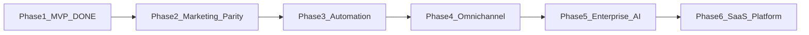

# Reach — Product Roadmap

**Ultimate goal:** Reach is competitive with market leaders (WATI, Interakt, Respond.io tier) as a professional WhatsApp-first marketing platform — with a defensible moat via Arenarama CRM and construction-industry pipeline marketing.

**Strategy:** Internal excellence first (Arenarama sales team), then SaaS. Each phase ships usable value; no big-bang releases.

---

## Market parity definition

Reach is “similar to what’s on the market” when it delivers:

| Pillar | Market standard |
|--------|-----------------|
| **Connect** | Embedded Meta onboarding, multi-number support, webhook health monitoring |
| **Audience** | Import, segment, tag, dynamic lists, strong opt-in/consent |
| **Campaign** | Broadcasts, scheduling, personalization, rich templates, analytics |
| **Automate** | Visual flows, triggers, drip sequences, chatbot + human handoff |
| **Inbox** | Real-time team inbox, assignment, canned replies, internal notes |
| **Integrate** | CRM two-way sync, Zapier/webhooks, optional e-commerce |
| **Scale** | Multi-tenant SaaS, billing, roles, API, security hardening |

---

## Phase overview



| Phase | Name | Timeline | Comparable to |
|-------|------|----------|---------------|
| **1** | MVP (done) | — | Custom Meta API build |
| **2** | Marketing parity | 4–6 weeks | AiSensy / early WATI | **Done** |
| **3** | Automation & intelligence | 6–8 weeks | WATI / Interakt core |
| **4** | Omnichannel & integrations | 6–8 weeks | WATI + light Respond.io |
| **5** | Enterprise & AI | 8–10 weeks | Respond.io mid-tier |
| **6** | SaaS platform | 8–12 weeks | Full commercial product |

---

## Phase 1 — MVP ✅ (Complete)

**Goal:** Arenarama can connect WhatsApp, import contacts, send template campaigns, and reply from a shared inbox.

**Delivered:**
- Meta Cloud API (templates, webhooks, session messages)
- Contacts, lists, CSV + Arenarama CRM import
- Campaign wizard + per-recipient delivery tracking
- Shared inbox, assignment, basic compliance (STOP, audit)
- Team auth, dashboard, setup GUI for token/phone change

**Success criteria:** Met for internal pilot with real Meta credentials.

---

## Phase 2 — Marketing parity

**Goal:** Match the **broadcast marketing** baseline of budget market leaders. Arenarama sales can run professional campaigns safely at scale.

### Features

| # | Feature | Details |
|---|---------|---------|
| 2.1 | **Per-contact personalization** | Map template variables to contact fields (`name`, `customFields`, CRM stage) |
| 2.2 | **Campaign scheduling** | Schedule send datetime; UI + worker respects `scheduledAt` |
| 2.3 | **Campaign control** | Pause/resume/cancel in UI; worker honours pause; no orphan sends |
| 2.4 | **Strict opt-in** | Default block `Unknown`; opt-in campaign template; consent record per contact |
| 2.5 | **List management UI** | Add/remove members, bulk add from contacts, preview list size before send |
| 2.6 | **Rich template support** | Header, body, button components; preview with sample contact |
| 2.7 | **Webhook hardening** | Meta `X-Hub-Signature-256` verification; auto health check (not manual toggle) |
| 2.8 | **Analytics v1** | Per-campaign export (CSV); template performance; opt-out rate over time |
| 2.9 | **Real-time updates** | SSE or WebSocket for inbox + campaign progress |
| 2.10 | **Scale fixes** | Remove 500/100 caps; pagination on contacts, conversations, recipients |
| 2.11 | **Role-based UI** | Agent → inbox only; Marketer → campaigns; Admin → setup + team |
| 2.12 | **Template sync cron** | Start nightly sync worker on API boot |

### Success criteria
- [x] Send scheduled campaign with `{{name}}` per contact
- [x] Pause mid-send without duplicate messages
- [x] Zero sends to non–opted-in contacts when strict mode on
- [x] Webhook rejects unsigned payloads (when `META_APP_SECRET` set)
- [x] Export campaign results CSV

### Dependencies
- Redis stable for scheduled jobs
- Meta approved templates with variables

---

## Phase 3 — Automation & intelligence

**Goal:** Match **WATI / Interakt** automation — flows, triggers, and CRM-aware journeys. This is where Reach stops being “broadcast tool” and becomes “marketing platform”.

### Features

| # | Feature | Details |
|---|---------|---------|
| 3.1 | **Visual workflow builder** | Drag-and-drop: trigger → delay → send template → branch on reply/keyword |
| 3.2 | **Trigger library** | Tag added, CRM stage change, inbound keyword, campaign replied, time-based |
| 3.3 | **Drip sequences** | Multi-step campaigns over days (e.g. day 0, 3, 7) |
| 3.4 | **Chatbot (rule-based)** | Keyword menus, FAQ branches, handoff to human when stuck |
| 3.5 | **Canned replies** | Team snippets in inbox; quick insert |
| 3.6 | **Internal notes** | Agent notes on conversation (not sent to contact) |
| 3.7 | **Auto-assign** | Round-robin or load-based inbox routing |
| 3.8 | **Arenarama CRM two-way sync** | Push WhatsApp events as CRM comments; pull stage changes as triggers |
| 3.9 | **Pipeline campaigns** | Pre-built journeys: NonCompliant → Compliant → Building templates |
| 3.10 | **Contact merge & dedup** | Merge duplicate phones; link `crmLeadId` reliably |
| 3.11 | **Inbox media** | Receive/send images, documents, voice notes |
| 3.12 | **Business hours** | Auto-reply outside hours; queue for next day |

### Success criteria
- [x] Build a 3-step drip without code
- [x] CRM lead stage change triggers template send
- [x] Inbound “PRICING” keyword runs chatbot menu
- [x] Agent handoff preserves full thread context

### Moat
Construction-specific automation templates competitors don’t ship out of the box.

---

## Phase 4 — Omnichannel & integrations

**Goal:** Match **WATI’s integration breadth** and light **Respond.io** omnichannel — without full enterprise complexity yet.

### Features

| # | Feature | Details |
|---|---------|---------|
| 4.1 | **Email channel** | SendGrid/Resend; unified contact timeline |
| 4.2 | **SMS fallback** | Twilio/MessageBird for non-WhatsApp numbers |
| 4.3 | **Cross-channel campaigns** | WhatsApp first → email if unread in 48h |
| 4.4 | **Unified timeline** | All touchpoints on contact profile |
| 4.5 | **Public API** | REST API + API keys for external systems |
| 4.6 | **Outbound webhooks** | Notify Arenarama/others on reply, opt-out, campaign complete |
| 4.7 | **Zapier / Make** | Triggers and actions (new contact, inbound message, campaign sent) |
| 4.8 | **Click-to-WhatsApp ads** | Track CTWA referral; attribute conversations to ad campaigns |
| 4.9 | **Contact scoring** | Engagement score from opens, replies, opt-outs |
| 4.10 | **Advanced segmentation** | AND/OR tag rules, engagement filters, CRM stage sets |
| 4.11 | **Multi-number (optional)** | Secondary WABA for regions/brands (schema already org-scoped) |

### Success criteria
- [x] One contact sees WhatsApp + email in single timeline
- [x] Zapier trigger fires on inbound message
- [x] Cross-channel campaign completes end-to-end

---

## Phase 5 — Enterprise & AI

**Goal:** Approach **Respond.io** tier for larger teams — AI, advanced routing, compliance at scale.

### Features

| # | Feature | Details |
|---|---------|---------|
| 5.1 | **AI knowledge bot** | Train on docs/FAQ; answer in inbox; escalate to human |
| 5.2 | **AI agent assist** | Suggested replies, sentiment, summary for agents |
| 5.3 | **Advanced routing** | Skills-based, language, priority, SLA queues |
| 5.4 | **SLA & reporting** | First response time, resolution time, agent leaderboard |
| 5.5 | **CSAT** | Post-conversation survey template |
| 5.6 | **Compliance dashboard** | Opt-in rates, complaint log, Meta policy checklist |
| 5.7 | **Template management** | In-app template submit to Meta (where API allows) |
| 5.8 | **A/B testing** | Split campaign variants; winner by read/reply rate |
| 5.9 | **Link tracking** | Short links with click analytics in messages |
| 5.10 | **Instagram / Messenger** | Additional channels in unified inbox (Meta suite) |
| 5.11 | **Audit & retention** | Configurable message retention; export for legal |

### Success criteria
- [x] AI bot resolves 40%+ FAQ without human (pilot metric)
- [x] SLA report exported for management
- [x] A/B campaign picks winner automatically

---

## Phase 6 — SaaS platform

**Goal:** Commercial product any business can sign up for — billing, onboarding, multi-tenancy.

### Features

| # | Feature | Details |
|---|---------|---------|
| 6.1 | **Self-service signup** | Org creation, email verify, onboarding wizard |
| 6.2 | **Stripe billing** | Plans by contacts/messages; usage metering |
| 6.3 | **Embedded Meta signup** | Official embedded WABA onboarding flow |
| 6.4 | **Custom domains** | `app.reach.io` or customer subdomain |
| 6.5 | **White-label (optional)** | Agency reseller mode |
| 6.6 | **Multi-tenant isolation** | Row-level security audit; per-tenant rate limits |
| 6.7 | **Status page & monitoring** | Uptime, queue depth, Meta API health |
| 6.8 | **Documentation & help** | In-app guides, API docs, template library |
| 6.9 | **Mobile agent app (optional)** | PWA or React Native for field sales |

### Success criteria
- [x] Self-service signup with org creation and onboarding wizard
- [x] Stripe billing with plan limits and usage metering (dev mode without Stripe keys)
- [x] Meta embedded signup launcher in WhatsApp Setup
- [x] Custom subdomain, custom domain, and white-label branding settings
- [x] Per-tenant rate limits and plan enforcement on contacts/campaigns
- [x] Public status page and in-app help documentation
- [x] PWA manifest for mobile agent inbox access

---

## What we deliberately skip (unless strategy changes)

| Feature | Why defer |
|---------|-----------|
| Shopify catalog / in-chat payments | Not Arenarama’s core; add only if D2C pivot |
| Voice / WhatsApp Calling | Niche; Respond.io enterprise feature |
| Full omnichannel (LINE, WeChat, TikTok) | Phase 5+ only if customer demand |
| Replace Arenarama ERP | Out of scope |

---

## Recommended execution order (next 90 days)

```
Month 1  → Phase 2 (marketing parity) — highest ROI for sales team
Month 2  → Phase 3.1–3.8 (automation core + CRM sync) — differentiation
Month 3  → Phase 3.9–3.12 + Phase 4.1–4.4 (pipeline journeys + email) — platform feel
```

After Month 3, reassess: if internal adoption is strong, continue Phase 4–5 before SaaS. If external demand appears, parallel Phase 6 billing with Phase 4.

---

## Phase 2 — suggested sprint breakdown

| Sprint | Deliverables |
|--------|--------------|
| **2A** | Per-contact variables, scheduling UI, pause/cancel worker |
| **2B** | Strict opt-in, list member UI, pagination |
| **2C** | Webhook signatures, template sync cron, SSE live updates |
| **2D** | Analytics export, role-based nav, rich template preview |

---

## Tracking

Update this file when a phase completes. Link PRs/commits to phase IDs (e.g. `feat(reach): 2.1 per-contact template variables`).

**Current status:** Phase 1–7 complete — production-ready

---

## Phase 7 — Production hosting (after Phases 2–6)

**Goal:** Deploy Reach to your hosting with managed PostgreSQL. Run this phase only after product upgrades are complete.

### Checklist

| Step | Task |
|------|------|
| 7.1 | Provision PostgreSQL on host; set `DATABASE_URL` |
| 7.2 | Provision Redis (or managed queue) for BullMQ |
| 7.3 | Set production env: `JWT_SECRET`, `TOKEN_ENCRYPTION_KEY`, `META_*`, `CLIENT_ORIGIN` |
| 7.4 | Run `prisma db push` + seed admin user |
| 7.5 | Deploy API (Node 20+) behind HTTPS reverse proxy |
| 7.6 | Build web (`npm run build -w @reach/web`); serve static or CDN |
| 7.7 | Point Meta webhook to `https://yourdomain.com/api/webhooks/whatsapp` |
| 7.8 | Enable `META_APP_SECRET` for webhook signature verification |
| 7.9 | Process manager (PM2/systemd); health check on `/api/health` |
| 7.10 | Backups for PostgreSQL; log rotation |

### Notes

- Reach already uses PostgreSQL in development — no SQLite migration needed.
- Use the same schema; only connection string changes.
- Redis is required for campaigns and scheduled jobs.

### Success criteria
- [x] Docker production stack (API + nginx + Redis)
- [x] Managed PostgreSQL via `DATABASE_URL`
- [x] HTTPS-ready nginx reverse proxy
- [x] Enhanced `/api/health` (DB + Redis)
- [x] PM2, systemd, backup scripts, and `DEPLOY.md` runbook

---
